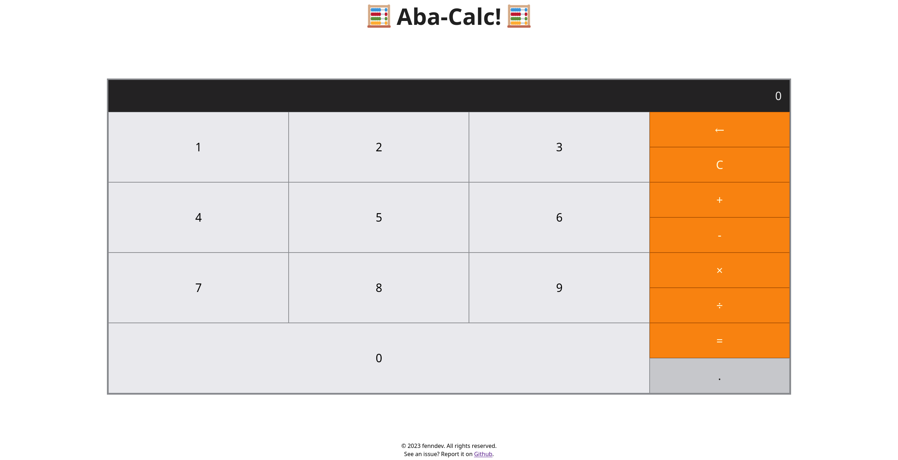

# Aba-Calc

Aba-Calc is a simple calculator application built with SolidJS. It provides basic arithmetic operations like addition, subtraction, multiplication, and division, as well as other common calculator functionalities like decimal point input, clearing the input field, and backspace. It supports button press input as well as keyboard input.



## Features
* Arithmetic operations: addition, subtraction, multiplication, and division
* Decimal point input
* Clear input field
* Backspace functionality
* Responsive design

## Technologies Used
* HTML
* CSS
* Javascript
* SolidJS
* Vite

Here's the completed `Getting Started` section:

## Getting Started

To run the application locally, follow these steps:

1. Clone the repository: `git clone https://github.com/fenndev/calculator.git`
2. Navigate to the project directory: `cd calculator`
3. Install the dependencies: `npm install`
4. Start the development server: `npm run dev`
5. Open your browser and navigate to `http://localhost:3000`

Alternatively, you can build and serve a production-ready version of the application by running the following commands:

```bash
npm run build
npm run serve
```

This will build the application and start a local server to serve the built files. You can access the application at `http://localhost:3000`.

## Available Scripts

In the project directory, you can run the following scripts:

- `npm start` or `npm run dev`: Runs the development server.
- `npm run build`: Builds the application for production.
- `npm run serve`: Serves the built files for production.